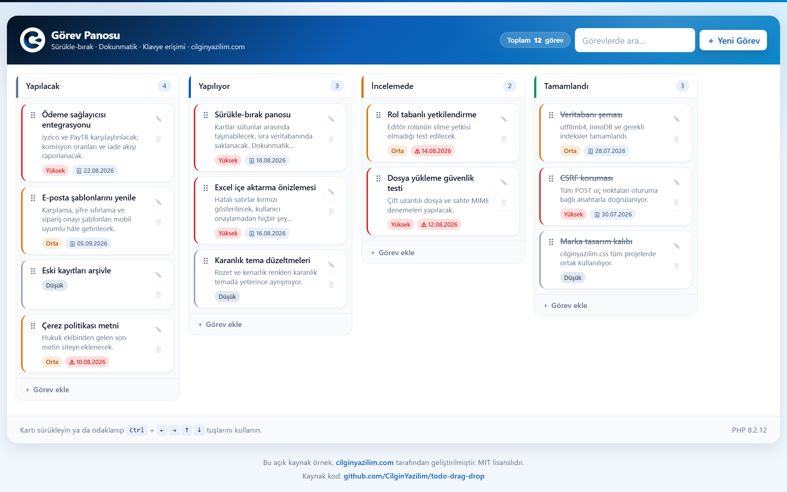
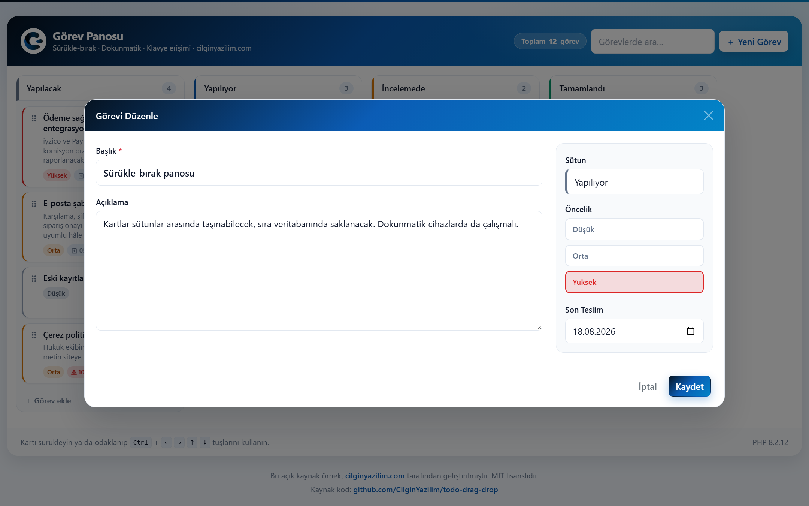

<div align="center">


# Sürükle-Bırak Görev Panosu

**PHP · MySQL · Saf JavaScript** ile Kanban tarzı görev panosu.
Sürükle-bırak kütüphanesi **yok** — motorun tamamı açıklamalı ~250 satır.


Fare · Dokunmatik · Klavye · CSRF korumalı AJAX

**[cilginyazilim.com](https://cilginyazilim.com)**

**Türkçe** · [English](README.en.md)

</div>

---

<div align="center">



<em>Dört sütun, renkli öncelik şeritleri, gecikmiş görev uyarıları ve tamamlanan işlerde üstü çizili başlıklar.</em>

</div>

---

## İçindekiler

| | |
|---|---|
| [Ne yapıyor?](#ne-yapıyor) | [Sürükle-bırak nasıl çalışıyor?](#sürükle-bırak-nasıl-çalışıyor) |
| [Nerelerde kullanabilirsiniz?](#nerelerde-kullanabilirsiniz) | [Sıralama nasıl saklanıyor?](#sıralama-nasıl-saklanıyor) |
| [Kurulum](#kurulum) | [API uç noktaları](#api-uç-noktaları) |
| [Hangi dosya ne işe yarıyor?](#hangi-dosya-ne-işe-yarıyor) | [Güvenlik](#güvenlik) |
| [Veritabanı](#veritabanı) | [Özelleştirme](#özelleştirme) |
| [Mobil uyum](#mobil-uyum) | |

---

## Ne yapıyor?

Sütunlar arasında sürüklenebilen görev kartları. Bıraktığınız yer **veritabanına yazılır**; sayfayı yenilediğinizde kartlar aynı yerde durur.

- **Sürükle-bırak** — kartı sütun içinde yeniden sıralayın veya başka sütuna taşıyın
- **Üç girdi yöntemi** — fare, dokunmatik ekran ve klavye; üçü de aynı işi yapar
- **Telefonda da tam işlevli** — 44px dokunma hedefleri, sütunlara yapışan kaydırma, tam ekran form ([ayrıntı](#mobil-uyum))
- **Öncelik ve tarih** — düşük/orta/yüksek renk kodlu, son teslim tarihi geçenler işaretlenir
- **Tam CRUD** — sütun bazlı hızlı ekleme, modal ile düzenleme, onaylı silme
- **Anlık arama** — başlık ve açıklamada, 300 ms geciktirmeli
- **Veriyle şekillenen pano** — sütunların adı, rengi, sırası ve "bu sütun bitmiş demek" bayrağı veritabanından gelir
- **Sıfır bağımlılık** — `npm install` yok, `composer install` yok. Kopyala, SQL'i içe aktar, çalıştır.

<div align="center">



<em>Düzenleme modalı: solda serbest metin, sağda sınıflandırma paneli.</em>

</div>

---

## Nerelerde kullanabilirsiniz?

Bu depo hem **öğretici bir kaynak** hem de **üzerine inşa edilebilir bir temeldir**. Sürükle-bırak + sıralama kalıcılığı, göründüğünden çok daha geniş bir alanda karşınıza çıkar:

| Alan | Nasıl uyarlanır? |
|------|------------------|
| **Proje / görev takibi** | Doğrudan bu hâliyle. Sütunlara "Backlog, Sprint, Test, Yayında" deyin. |
| **Sipariş / kargo takibi** | Sütunlar sipariş durumları olur: "Yeni → Hazırlanıyor → Kargoda → Teslim". Kartı taşımak durumu değiştirir. |
| **Servis / arıza kaydı** | "Açık → Atandı → Çözüldü". `is_done` bayrağı kapanan kayıtları işaretler. |
| **İşe alım süreci** | Aday kartları: "Başvuru → Ön görüşme → Teknik → Teklif". |
| **İçerik yayın takvimi** | "Fikir → Yazılıyor → Editörde → Yayında". Son teslim tarihi yayın tarihi olur. |
| **Ders / ödev planlayıcı** | Öğrenci projeleri ve teslim tarihleri için hazır iskelet. |
| **Depo / stok hareketi** | Raf veya lokasyon sütunları arasında ürün kartları. |

**Kod tarafında öğretici değeri:** Sürükle-bırak motoru dışında da yeniden kullanabileceğiniz kalıplar var — CSRF korumalı AJAX uç noktası, tek dosyada toplanan `action` yönlendirmesi, sunucu tarafı doğrulama katmanı, iyimser güncelleme (optimistic update) ve geri alma planı, `sort_order` ile sıra kalıcılığı.

---

## Kurulum

**Gereksinimler:** PHP 8.0+, MySQL 5.7+ / MariaDB 10.2+ (XAMPP, Laragon veya herhangi bir LAMP yeterli)

```bash
# 1. Dosyaları web köküne koyun
cd C:/xampp/htdocs
git clone https://github.com/CilginYazilim/todo-drag-drop.git

# 2. Veritabanını içe aktarın (cy_todo şemasını kendi oluşturur)
mysql -u root -p < todo-drag-drop/cy_todo.sql
```

> phpMyAdmin kullanıyorsanız: **İçe Aktar → Dosya seç → `cy_todo.sql` → Başlat**

Ardından tarayıcıdan: **`http://localhost/todo-drag-drop/`**

### Farklı bir veritabanı kullanacaksanız

`system/config.php` içindeki `DB_*` satırlarını düzenleyin **veya** sunucunuzda ortam değişkeni tanımlayın (şifreyi koda yazmamak için tercih edilen yol):

```
DB_HOST=127.0.0.1   DB_NAME=cy_todo   DB_USER=root   DB_PASS=gizli
```

### Canlıya alırken

Hata ayıklama kendiliğinden kapanır — `APP_DEBUG` sabit `true` değildir, ortama bakar: yerel adreslerde (`localhost`, `127.0.0.1`, `*.test`, `*.local`) açık, gerçek bir alan adında kapalıdır. İstediğiniz zaman `APP_DEBUG` ortam değişkeniyle bunu elle de belirleyebilirsiniz.

---

## Hangi dosya ne işe yarıyor?

```
todo-drag-drop/
├── index.php                 ← Arayüz iskeleti + modallar (pano BOŞ çizilir)
├── cy_todo.sql               ← Veritabanı kurulumu ve örnek pano
│
├── system/
│   ├── .htaccess             ← config/function dosyalarına doğrudan HTTP erişimini kapatır
│   ├── config.php            ← Oturum, ayarlar, sabitler, PDO bağlantısı
│   ├── function.php          ← Yardımcılar: CSRF, doğrulama, veri erişimi, biçimleme
│   └── ajax.php              ← JSON uç noktası: pano, ekle/düzenle/sil, taşı
│
└── assets/
    ├── css/
    │   ├── bootstrap.min.css ← Temel çatı
    │   ├── cilginyazilim.css ← MARKA TASARIM KALIBI (tüm CY projelerinde ortak)
    │   └── style.css         ← Yalnızca bu sayfaya özel: pano, kart, sürükleme durumları
    ├── js/
    │   ├── jquery-3.7.0.js
    │   ├── bootstrap.bundle.js
    │   └── board.js          ← SÜRÜKLE-BIRAK MOTORU + tüm arayüz mantığı
    └── images/
        ├── logo.png
        └── screenshot*.png
```

### Katmanlar arasındaki iş bölümü

| Katman | Sorumluluğu | Sorumlu **olmadığı** şey |
|--------|-------------|--------------------------|
| `index.php` | HTML iskeleti, modallar, CSRF anahtarını sayfaya gömmek | Veritabanı sorgusu **yapmaz** |
| `system/config.php` | Oturum güvenliği, sabitler, PDO bağlantısı | İş mantığı içermez |
| `system/function.php` | Doğrulama, CSRF, veri okuma, biçimleme | HTTP yanıtı **yönlendirmez** |
| `system/ajax.php` | İstek yönlendirme, yetki kontrolü, yazma işlemleri | HTML **üretmez**, sadece JSON |
| `assets/js/board.js` | Çizim, sürükleme, klavye, AJAX | Doğrulamaya **güvenilmez** (sunucu tekrar eder) |

**`function.php` neden `config.php`'yi dahil etmiyor?** Veritabanına ihtiyaç duyan fonksiyonlar PDO nesnesini **parametre olarak** alır (`fetch_board($db)`). Böylece her çağrıda yeni bağlantı açılmaz ve fonksiyonlar tek başına test edilebilir kalır. *(Bağımlılık enjeksiyonu)*

**Pano neden PHP ile değil JavaScript ile çiziliyor?** Kartlar sürüklendikçe, eklendikçe ve silindikçe pano sürekli yeniden çizilir. Aynı kart HTML'ini bir PHP'de bir JavaScript'te iki kez yazmak, ikisinin zamanla ayrışması demektir. Tek bir çizim yeri bu riski ortadan kaldırır.

### Öne çıkan fonksiyonlar

| Fonksiyon | Dosya | Ne yapar? |
|-----------|-------|-----------|
| `csrf_token()` / `require_csrf()` | `function.php` | Oturuma bağlı anahtar üretir; `hash_equals()` ile sabit süreli doğrular |
| `send_security_headers()` | `function.php` | CSP, `X-Frame-Options`, `nosniff`, `Referrer-Policy` |
| `validate_task_*()` | `function.php` | Her biri `[temizlenmiş değer, hata]` çifti döndürür |
| `fetch_board()` | `function.php` | Tüm panoyu **iki sorguda** getirir (N+1 problemi yok) |
| `present_task()` | `function.php` | Ham satırı arayüzün beklediği biçime çevirir (gecikme hesabı tek yerde) |
| `column_task_ids()` | `function.php` | Sütundaki id'leri sırayla verir — hem sıkıştırma hem **yetki kontrolü** için |
| `resequence_column()` | `ajax.php` | Silme/taşıma sonrası numaraları 0,1,2… diye sıkıştırır |
| `handle_move()` | `ajax.php` | **Uygulamanın kalbi** — sırayı tek transaction'da yazar |
| `onPointerDown/Move/Up` | `board.js` | Sürükleme motorunun üç aşaması |
| `persistMove()` | `board.js` | İyimser güncelleme + başarısızlıkta panoyu geri yükleme |

---

## Sürükle-bırak nasıl çalışıyor?

### Neden hazır kütüphane yok?

SortableJS veya jQuery UI kullanmak gerçek bir projede gayet makuldür. Ama sürükle-bırak, "nasıl çalıştığı anlaşılmadan kullanılan" özelliklerin başında gelir. Buradaki motor üç şeyi öğretir: **imleç takibi**, **bırakma hedefinin bulunması** ve **sıranın kalıcı hâle getirilmesi**. Bir kez okuduğunuzda, hazır kütüphaneyi de bilerek kullanırsınız.

### Neden HTML5 `draggable` değil, Pointer Events?

Tarayıcıların yerleşik `draggable` API'si **dokunmatik cihazlarda çalışmaz** ve sürüklenen öğenin görünümü üzerinde neredeyse hiç denetim vermez. Pointer Events fare, dokunmatik ve kalemi tek olay kümesinde birleştirir: bir kez yazarsınız, üçünde de çalışır.

### Üç aşama

```
pointerdown → başlangıç noktasını kaydet (henüz sürükleme YOK)
pointermove → 5px eşik aşılınca başlat, hedefi bul, kartı oraya taşı
pointerup   → yeni sırayı sunucuya yaz
```

**Kartın kendisi yer tutucudur.** Ayrı bir placeholder elemanı üretmek yerine, sürüklenen kartın ta kendisini DOM içinde gezdiririz; parmağın altında görünen şey onun bir kopyasıdır (*ghost*). Böylece bırakma anında yapılacak iş kalmaz — kart zaten doğru yerdedir.

**Ekleme noktası nasıl bulunur?** Sütundaki her kartın dikey **orta noktasına** bakılır. İmleç bir kartın orta noktasının üstündeyse kart ondan önce, değilse sonra gelir. Bu basit kural, kartlar farklı yüksekliklerde olsa bile doğru çalışır.

### Beş kritik ayrıntı

| Ayrıntı | Neden |
|---------|-------|
| `pointer-events: none` (ghost üzerinde) | Açık olsaydı `elementFromPoint` her zaman ghost'u bulur, altındaki sütunu asla göremezdik ve kart hiçbir yere bırakılamazdı. |
| `touch-action: none` (yalnızca tutamaçta) | Bu satır olmadan dokunmatik cihazda sürükleme başlamaz. **Yalnızca** tutamaca verilir: kartın tamamına verilseydi telefonda sütunu parmakla kaydırmak imkânsız olurdu. |
| Kenarda otomatik kaydırma | Sürükleme sırasında normal kaydırma çalışmaz. Bu olmadan ekrana sığmayan bir sütunun altına kart taşımak mümkün değildir. |
| `setPointerCapture()` | Parmak hızla kartın dışına çıktığında tarayıcı `pointercancel` gönderip sürüklemeyi kesiyordu; kart yarı yolda başladığı yere dönüyordu. Yakalama, o işaretleyicinin tüm olaylarını karta yönlendirir ve kesilmeyi tamamen ortadan kaldırır. |
| Kopyanın parmaktan yukarı kaydırılması | Fare imleci birkaç piksellik bir oktur, kartı kapatmaz; **parmak ise kartın tamamını örter.** Ghost'u imlecin tam altına koymak, mobil kullanıcıyı hem taşıdığı karta hem bırakma noktasına kör bırakıyordu. `TOUCH_GHOST_LIFT` yalnızca `pointerType === 'touch'` iken uygulanır. |

### Klavye erişimi

Sürükle-bırak yalnızca fare/parmakla kullanılabilen bir özelliktir. Klavye alternatifi yazmamak, özelliği bazı kullanıcılar için **tamamen erişilemez** kılar. Karta odaklanın ve:

| Kısayol | İşlev |
|---------|-------|
| <kbd>Ctrl</kbd> + <kbd>↑</kbd> / <kbd>↓</kbd> | Kartı sütun içinde yukarı/aşağı taşı |
| <kbd>Ctrl</kbd> + <kbd>←</kbd> / <kbd>→</kbd> | Kartı önceki/sonraki sütuna taşı |
| <kbd>Esc</kbd> | Süren sürüklemeyi iptal et |

`Ctrl` bilinçli olarak zorunludur: yalnızca ok tuşları kullanılsaydı, kartlar arasında gezinmek isteyen klavye kullanıcısı istemeden panoyu yeniden düzenlerdi.

---

## Mobil uyum

Kanban panosu **yatayda geniş**, telefon ekranı ise dardır. Bu çelişki, "responsive" etiketi yapıştırıp geçilecek bir konu değil; panonun telefonda kullanılabilir olması için düzenin birkaç yerde farklı davranması gerekir.

### Ölçü değil, girdi türü sorulur

Mobil düzeltmelerin çoğu ekran genişliğine değil, **`@media (hover: none)`** sorgusuna bağlıdır.

```css
@media (hover: none) { … }   /* "üzerine gelinebilen bir işaretleyici yok" */
```

Genişlik yanıltıcıdır: küçültülmüş bir masaüstü penceresinin klavyesi ve faresi vardır, geniş bir tabletin ise yoktur. Dokunma hedefi büyütmek, soluk butonları görünür kılmak gibi düzeltmelerin gerçek koşulu "ekran dar mı" değil, **"parmakla mı kullanılıyor"** sorusudur.

Aynı sorgu alt bilgideki ipucunu da seçer: fareli cihazda <kbd>Ctrl</kbd> + ok tuşları anlatılır, dokunmatikte tutamaç. Telefonda klavye kısayolu yazmak yanlış bilgi vermektir.

### Dokunma hedefleri

| Öğe | Masaüstü | Dokunmatik |
|-----|----------|------------|
| Düzenle / Sil ikonları | 34 px | **44 px** |
| Sürükleme tutamacı | dar bir metin parçası | **44 px genişlik, kartın tam yüksekliği** |

44 px, WCAG 2.5.8 ve Apple HIG'in ortaklaştığı alt sınırdır. Tutamaç için ayrıca önemlidir: **sürüklemenin başladığı tek noktadır**, ıskalandığında özellik hiç çalışmaz.

Ama ikonları 44 px yapmak yeni bir sorun doğurdu — masaüstündeki "kartın sağında alt alta iki ikon" dizilimi 88 px'lik bir sütuna dönüştü ve kartlar devasa göründü. Çözüm, butonları **rozetlerle aynı satıra**, kartın sağ alt köşesine almak: öncelik ve tarih rozetleri sola yaslı olduğu için o satırın sağı zaten boştu.

### Sütunlara yapışan kaydırma

```css
.cy-board  { scroll-snap-type: x mandatory; }
.cy-column { scroll-snap-align: start; scroll-snap-stop: always; }
```

Parmağı bıraktığınızda pano rastgele bir yerde durmaz, en yakın sütunu hizalar. İki sütunun yarısını birden gösteren bir duruş, telefonda kartların okunmasını zorlaştırıyordu.

> **Ama sürükleme sırasında yapışma kapatılır** (`body.cy-dragging .cy-board`). Açık kalsaydı, otomatik kaydırmanın yazdığı her `scrollLeft` değeri anında en yakın sütuna geri yapışır ve kartı yandaki sütuna taşımaya çalışırken pano titrerdi.

### Diğer düzeltmeler

| Sorun | Çözüm |
|-------|-------|
| Pano sonuna gelince hareket sayfaya devredip "aşağı çekip yenile"yi tetikliyordu | `overscroll-behavior: contain` — kaydırma kutunun içinde kalır |
| Uzun listede sütun başlığı ekrandan çıkınca hangi sütunda olunduğu kayboluyordu | Başlık `position: sticky`. Bunun için `.cy-column`'daki `overflow: hidden` → `clip` yapıldı: `hidden` kutuyu kaydırma konteyneri sayar ve yapışmayı sessizce öldürür |
| Modal telefonda dar kalıyor, klavye açılınca başlığı ekran dışına itiliyordu | `modal-fullscreen-sm-down` — tam ekran |
| Tam ekran modal altta gri şerit bırakıyordu | `.modal-dialog`'un `height: 100%`'i, araya giren `<form>`'a akmıyordu; forma da verildi |
| Başlık/Açıklama kutuları modalın yalnızca sol yarısını kaplıyordu | `align-items: flex-start`, dikey dizilime geçince anlamını değiştirip çocukları içeriğe büzüyordu → `stretch` |
| Başlık kutusuna dokununca iOS sayfayı yakınlaştırıp öyle bırakıyordu | Yazı tipi boyutu `1rem` (=16px); Safari 16px altındaki alanlarda otomatik yakınlaştırır |
| Arama hiçbir şey bulmadığında pano boş sütunlar gösteriyor, kullanıcı bunu "görevlerim silindi" diye okuyabiliyordu | Panonun üstünde açıkça uyarı |
| Aramadan sonra sanal klavye ekranın yarısını kaplamaya devam ediyordu | <kbd>Enter</kbd> → ara ve `blur()`; <kbd>Esc</kbd> → temizle |
| Sürüklemenin başladığı an parmağın altında görsel olarak belirsizdi | `navigator.vibrate(10)` — destekleyen cihazlarda 10 ms titreşim, yoksa sessizce atlanır |
| Çentikli telefonlarda alt bilgi ana ekran çubuğunun altında kalıyordu | `viewport-fit=cover` + `env(safe-area-inset-*)`, `max()` ile sarmalanmış |

> **Bilerek yapılmayan:** `maximum-scale=1` / `user-scalable=no`. Yakınlaştırmayı kapatmak sayfayı az gören kullanıcılar için kullanılamaz kılan bir erişilebilirlik hatasıdır — "mobil görünüm daha derli toplu olsun" diye ödenmeyecek kadar yüksek bir bedel.

---

## Sıralama nasıl saklanıyor?

`tasks.sort_order` sütununda; her sütun kendi içinde 0'dan başlayarak numaralanır.

**İstemci ne gönderir?** Taşınan kartın id'si, bırakıldığı sütun ve **o sütundaki tüm kartların yeni sırası**. Tek bir kartın konumunu bildirmek, sunucunun geri kalan kartları nasıl kaydıracağını tahmin etmesini gerektirirdi. Tarayıcı zaten doğru sırayı ekranda tutuyor; onu olduğu gibi göndermek hem daha basit hem de ekranla veritabanının ayrışmasını imkânsız kılar.

**Neden kesirli sayı (0.5 gibi araya sıkıştırma) yok?** Kesirli yaklaşım tek satır güncellemesiyle daha hızlıdır ama zamanla hassasiyet tükenir ve yeniden numaralandırma gerekir. Sütun başına birkaç yüz kart için tamsayıları tek transaction'da yeniden yazmak hem basit hem yeterince hızlıdır ve **her zaman tutarlıdır**.

**İyimser güncelleme.** Kart, sunucunun onayı beklenmeden ekranda yeni yerine taşınır — beklemek her bırakmada gözle görülür bir donma yaratırdı. Karşılığında bir söz verilir: istek başarısız olursa pano sunucudan yeniden yüklenip ekran gerçeğe döndürülür.

> *İyimser güncellemeyi geri alma planı olmadan kullanmak, kullanıcıya yalan söylemektir.*

---

## API uç noktaları

Hepsi **`POST system/ajax.php`** adresine gider, hepsi `csrf_token` ister, hepsi JSON döner.

| `action` | Ek parametreler | Döner |
|----------|-----------------|-------|
| `board` | `search` *(isteğe bağlı)* | `columns[]`, `total` |
| `add` | `title`, `column_id`, `description`, `priority`, `due_date` | `id` |
| `edit` | `task_id` + yukarıdakiler | `id` |
| `fetch` | `id` | Tek görevin tüm alanları |
| `delete` | `id` | `id` |
| `move` | `task_id`, `column_id`, `order[]` | `id`, `column_id` |

**Yanıt biçimi** her zaman aynıdır — istemcinin tek bir hata gösterme yolu olması için:

```json
{ "success": true,  "type": "success", "description": "Görev eklendi.", "id": 13 }
{ "success": false, "type": "danger",  "description": "Lütfen formdaki hataları düzeltin.",
  "errors": { "title": "Görev başlığı en az 3 karakter olmalıdır." } }
```

**Kullanılan HTTP kodları:** `200` başarılı · `400` geçersiz istek · `403` CSRF geçersiz · `404` kayıt yok · `405` POST değil · `422` doğrulama hatası · `500` sunucu hatası

> **Neden 419 değil de 403?** Bazı çerçeveler CSRF hatası için `419` kullanır. Ancak 419 IANA'ya kayıtlı bir kod değildir: **Apache onu tanımadığı için yanıt satırını sessizce `500 Internal Server Error` olarak yeniden yazar.** Sonuç, reddedilmiş bir isteğin sunucu çökmüş gibi görünmesidir. Bu depoda ölçülüp doğrulandı ve `403 Forbidden` ile değiştirildi.

**Neden tek dosya?** Her işlem için ayrı dosya açmak yerine tek giriş noktası kullanmak, güvenlik kontrollerini (CSRF, POST zorunluluğu, hata yakalama) **tek yerde** toplamayı sağlar. Böylece bir kontrolü yanlışlıkla bir dosyada unutma riski kalmaz.

---

## Veritabanı

**İki tablo:** `task_columns` (sütunlar) ve `tasks` (kartlar).

```
task_columns                          tasks
├── id                                ├── id
├── title       "Yapılıyor"           ├── column_id ──────┐ FK, ON DELETE CASCADE
├── accent      "#0b5cb5"             ├── title           │
├── sort_order  soldan sağa sıra      ├── description     │
└── is_done     "bu sütun = bitti"    ├── priority   ENUM(dusuk,orta,yuksek)
                        ▲             ├── due_date        │
                        └─────────────┤ sort_order   sütun İÇİNDEKİ sıra
                                      ├── created_at      │
                                      └── updated_at      │
```

**Sütunlar neden ayrı tabloda?** "Yapılacak / Yapılıyor / Tamamlandı" durumlarını görevin içinde bir ENUM olarak tutmak ilk bakışta daha basit görünür. Ama o zaman yeni sütun eklemek için `ALTER TABLE` gerekir ve sütun sırası, rengi, başlığı gibi bilgilere yer kalmaz. Ayrı tablo, panoyu **veriyle şekillendirilebilir** hâle getirir.

**`is_done` bayrağı**, sütunun *adına* bakarak ("Tamamlandı" mı?) karar vermenin kırılganlığını ortadan kaldırır — kullanıcı sütunu yeniden adlandırdığında hiçbir şey bozulmaz.

**Bileşik indeks `(column_id, sort_order)`**, panoyu çizen sorgunun ta kendisidir: `WHERE column_id = ? ORDER BY sort_order`. İki sütunu tek indekste, bu sırayla tutmak MySQL'in hem filtrelemeyi hem sıralamayı indeks üzerinden yapmasını sağlar.

**Tablo adı neden `columns` değil `task_columns`?** `columns` MySQL'de ayrılmış bir kelimedir; her sorguda ters tırnak zorunluluğu getirir ve er geç unutulup hata verir.

---

## Güvenlik

| Önlem | Nasıl uygulanıyor? |
|-------|--------------------|
| **CSRF** | Her POST, oturuma bağlı 32 baytlık anahtarla doğrulanır; `hash_equals()` ile zamanlama saldırısına kapalı karşılaştırma |
| **SQL Injection** | İstisnasız hazır ifadeler (prepared statements), `PDO::ATTR_EMULATE_PREPARES = false` |
| **XSS** | Sunucuda `htmlspecialchars()`, istemcide **her zaman** `.text()` — asla `.html()` |
| **Yalnızca POST** | `` gibi basit bir etiketin kayıt silmesi engellenir |
| **Oturum çerezi** | `HttpOnly` (JS okuyamaz) + `SameSite=Lax` (siteler arası POST'a eklenmez) + HTTPS'te `Secure` |
| **Güvenlik başlıkları** | CSP, `X-Frame-Options: DENY` (clickjacking), `nosniff`, `Referrer-Policy` |
| **Beyaz liste** | Öncelik "şunlar yasak" yerine "yalnızca şunlar serbest" kuralıyla doğrulanır |
| **Taşıma yetkisi** | `order[]` listesi, **hedef sütunun gerçek üyeleri + taşınan kart** ile sınırlanır |
| **Girdi sınırları** | Başlık, açıklama, arama terimi ve sütun başına kart sayısı üst sınırlıdır |
| **Transaction** | Taşımanın tamamı tek transaction'dadır; yarısı yazılmış bir sıralama, hiç yazılmamış olandan kötüdür |
| **Dosya erişimi** | `system/.htaccess`, `ajax.php` dışındaki dosyalara doğrudan HTTP erişimini reddeder |
| **Hata gizleme** | `APP_DEBUG` ortama göre kendiliğinden kapanır; canlıda tablo/sorgu adları sızmaz |
| **Yabancı anahtar** | Sütun silinirse görevleri de silinir (`ON DELETE CASCADE`); "yetim" kayıt birikmez |

### Taşıma yetkisi neden ayrı bir başlık?

`handle_move()`, listedeki her id için `UPDATE tasks SET column_id = :hedef` çalıştırır. Bu liste doğrulanmasaydı, `order[]` içine panonun **başka** bir sütunundaki kartların id'leri yazılarak o kartlar da hedef sütuna çekilebilirdi — kullanıcı hiçbir şey yapmadan kartlarının yer değiştirdiğini görürdü.

Kural nettir: hedef sütunun yeni listesi yalnızca **o sütunda zaten bulunan kartlardan** ve **sürüklenerek getirilen kartın kendisinden** oluşabilir. Bu kümenin dışındaki her id sessizce atılır *(pano başka bir sekmede değişmiş olabilir; isteği tümden reddetmek kullanıcıyı daha çok şaşırtırdı)*.

> **Not:** Bu örnekte kimlik doğrulama **yoktur** — panoyu açan herkes her kartı düzenleyebilir. Çok kullanıcılı bir ortamda kullanacaksanız, oturum açma ve "bu kart bu kullanıcıya ait mi?" kontrolünü eklemeniz gerekir.

---

## Özelleştirme

### Yeni sütun eklemek

Kod değişikliği **gerekmez**, tek satır SQL yeterlidir:

```sql
INSERT INTO task_columns (title, accent, sort_order, is_done)
VALUES ('Beklemede', '#7c3aed', 4, 0);
```

Renk panoda, formda ve kart kenarlarında kendiliğinden görünür.

### Yeni öncelik eklemek

İki yer güncellenir:

```sql
ALTER TABLE tasks MODIFY priority ENUM('dusuk','orta','yuksek','kritik') NOT NULL DEFAULT 'orta';
```

```php
// system/config.php — form, doğrulama ve rozetler bu diziden beslenir
define('TASK_PRIORITIES', [
    'dusuk'  => 'Düşük',
    'orta'   => 'Orta',
    'yuksek' => 'Yüksek',
    'kritik' => 'Kritik',   // ← yeni
]);
```

Ardından `assets/css/style.css` içine `.cy-priority--kritik` renk kuralını ekleyin.

### Ayarlanabilir sabitler

`system/config.php` içinde: `TASK_TITLE_MIN` / `TASK_TITLE_MAX` · `TASK_DESC_MAX` · `SEARCH_MAX` · `MAX_TASKS_PER_COLUMN` · `APP_DEBUG`

---

## Lisans

**MIT** — dilediğiniz gibi indirip kullanabilirsiniz, ticari projelerde de serbesttir.

Katkı için depoyu çatallayın ve pull request gönderin.

<div align="center">

---


**[Çılgın Yazılım](https://cilginyazilim.com)**

Açık kaynak, öğretici PHP örnekleri

**[Örnek kodlar &amp; kütüphane](https://cilginyazilim.com/kutuphane)** · [Bu projenin sayfası](https://cilginyazilim.com/kutuphane/surukle-birak-gorev-panosu)

[cilginyazilim.com](https://cilginyazilim.com) · [github.com/CilginYazilim](https://github.com/CilginYazilim)

</div>
